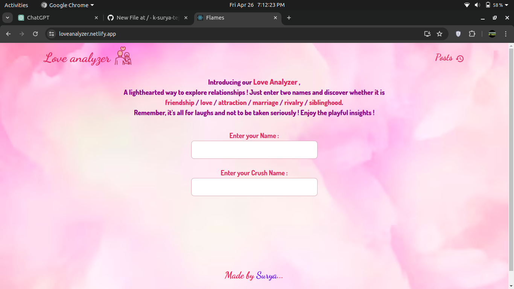

# Love Analyzer

Love Analyzer is a fun and interactive web application built to analyze the compatibility between individuals based on the famous FLAMES logic.
Live Demo : <a href="https://loveanalyzer.netlify.app/">https://loveanalyzer.netlify.app/</a>

## Features

- Analyze compatibility between individuals using the FLAMES logic.
- Interactive and user-friendly interface.
- Store user data securely with MongoDB.
- Built with React.js, Node.js, Express.js, and MongoDB.
- Styled with Bootstrap and Material UI.

## Installation

1. Clone this repository:
     git clone https://github.com/k-surya-teja/love-analyzer.git
   
2. Navigate to the `client` directory and install dependencies:
     cd client
     npm install

3. Navigate to the `server` directory and install dependencies:
     cd client
     npm install

## Usage

### Frontend (Client)
To start the frontend server, navigate to the client directory and run:

   npm start
   
This will start the React development server and open Love Analyzer in your default web browser.

### Backend (Server)
To start the backend server, navigate to the server directory and run:

  nodemon app.js

This will start the Node.js server.

## Contributing
Contributions are welcome! Feel free to open issues or pull requests.

## License
This project is licensed under the MIT License.

